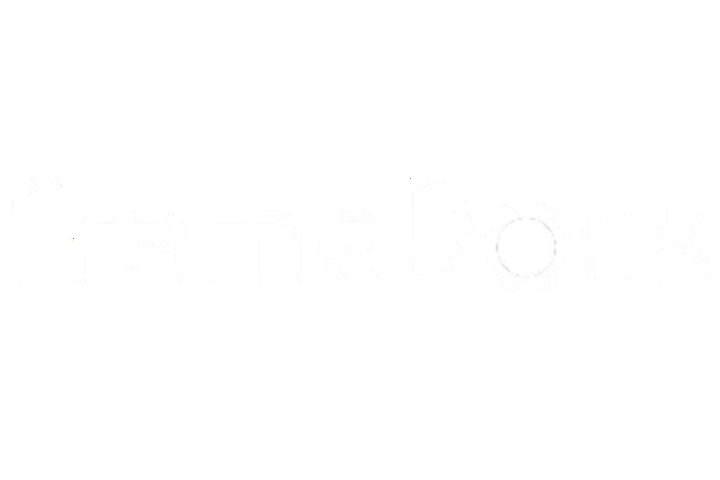

<p align="center">
  
</p>

# FrameDock
A custom dock for Linux operating systems to give you extra control over your operating system, especially with easy macros and other quick functions.

## Features
The dock has the following features:
 - Spawn in window with ctrl + space: use system manager
 - automatic centering based on the screen size
 - customization of dimensions, colors, transparency and other features made easy for the user
 - automatically figure out what apps are installed and mimic spotlight from macos
 - have built in dictionary and caclulator and ai search to act like spotlight

## Installation
You can download the package from Pypi!
```
pip3 install framedock
```
One it installs, you should have the command `framedock` installed on your system. To get this working, add it to your desktop manager's shortcut
key manager to be able to launch it with a keybind. This is the most secure way to do this without making what is effectively a keylogger.

## Hosting your own backend:
Since the script has the main backend hardcoded, you will need to compile it with your own endpoint set.
You can see the code for the backend in the `api/` folder, and you can just run main.py assuming all other files are there and it will spin up on port `5000` by default, you can configure binding in app.run() call. It is recommended to it behind a reverse proxy e.g. caddy.
The backend does have docs at `/docs` for you to refer to if needed.